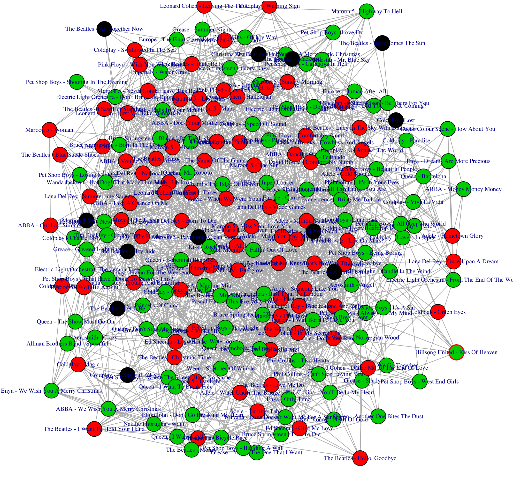

```{r setup, include=FALSE}
knitr::opts_chunk$set(echo = TRUE)
options(scipen=999)
library("knitr")
library("ggplot2")
library("data.table")
```
```{r setup2, include=FALSE, echo=FALSE, cache=F}
source("../src/code.R")
```
# Introduction

In this lab we are asked to analyse a network of our chosing that relates whichever concepts we are interested in.

We have created an Information Network whose nodes represent songs. We aim to analyze this network, explore some properties and find communities.
 
More specifically, we are interested on seeing which words are more frequently used, how the songs are connected based on their related words, and how well-connected or not the songs that we have each chosen are, to see if our tastes match or not.
 

# Creating the network

Let's start with creating the network.

## Vertices properties

The songs that will be used as vertices have been chosen manually from a datase found online \footnote{\url{https://www.kaggle.com/mousehead/songlyrics}}. 


Each node contains the following information:

- Band's name
- Song's name
- Lyrics


## Choosing the nodes

Since we are asked to have a network of at least 200 nodes, each one of us have chosen up to 100 songs. We have then merged the selection and since there's been some overlapping from both choosing the same songs, we have selected some more songs randomly and merged them too to ensure having at least 200 nodes.

This selection has resulted in 207 different songs being chosen.

## Lyrics treatment

Let us define our whole corpus as the addition of all the words, which we will refer to as terms, contained in all the song's lyrics.

As we have mentioned in the introduction, we will relate the nodes depending on the terms they have in common. However, there are many words that do not add value or meaning to a song such as `the` or `a`.

Additionally, many of these songs have weird terms stored such as `troup-er-er` (trouper) from `ABBA - Super trouper`.

Thus, both the non-interesting terms as well as the odd ones that  only appear once or twice in the whole corpus will interfere with the adjacency addition step, so we do not want to consider them.

Because of this, we have applied stemming and stopword removal to each song's lyrics as well as pruning those words that appear less than 5 times. 

Let us define $$TA_{min} = 0.15$$ as the minimum Term Appearance of each term in the whole corpus. This means that if a term appears in the whole corpus less than 15% respect to the total, then this word is not going to be taken into account and removed from our vocabulary.

Before applying the stemming, stopword removal and pruning, we had 7.693 words. After cleaning the lyrics we have ended up with only 56 different words.


## Adjacencies

To determine whether two nodes are connected or not, we are going to use the now clean terms obtained from their lyrics.

To do so, we have created a matrix of dimensions 207 x 56, where there are 207 songs and 56 different terms. Then, we have computed the *term frequency/inverse document frequency* (a.k.a. tf-idf) matrix and computed the cosine similarity of each song with all the others.

This cosine similarity computation results in a matrix of 207 x 207 with values that range from 0 to 1. We do not want to work with a weighted network, for it is out of our scope, so we are going to transform these values to binary ones by setting a threshold.

Let us define this Linking Threshold such that $$LT(d1, d2)_{min} = 0.35$$. This means that the  similarity between two songs has to be at least of 35%.

For each potential relationship, we are going to check if the similarity of those two song's lyrics is greater or equal than our threshold. If it is, then we are marking their relationship in an adjacency matrix with a 1. We will state otherwise with a zero.

This has ended with zero isolated nodes and a connected graph, meaning that all nodes can be reached from other ones.


\newpage

## Resulting network

The color in the vertices represent who has selected each vertex:

- Red: Carolina
- Green: Laura
- Black: Carolina & Laura




# Analyzing the network

It is worth mentioning that the results have varied a lot when tuning the parameters minimum values:

- Term Appearance ($TA_{min}$)
- Linking Threshold ($LT(d1, d2)_{min}$)

 
For now, we are going to analyze the network from the parameters chosen:

- Term Appearance ($TA_{min} = 0.15$)
- $LT(d1, d2)_{min} = 0.35$


## Basic metrics

First of all, we are going to check its basic metrics.

```{r echo=FALSE}
kable(computeSummaryTable(songsGraph),   caption="\\label{tab:table1}Summary table of the songs' graph",
      col.names = c("N", "E", "$\\langle k \\rangle$", "$\\delta$", "Diameter", "Transitivity"),
      align=rep('c', 5))
```

In the table above, we can see that we have 207 nodes and 1832 edges. Each vertex has, by average, between 17 and 18 edges (leaning towards 18). Since our Linking Threshold is very low, the number of edges and average degree was expected to be this high.

The density of the whole network is 0.09, which is very low. This is expected because of the threshold is not low enough to produce more edges.

The diameter is of 4, which is very small, meaning that we can reach any node by jumping at most 3 nodes.

Finally, the transitivity is of 0.3, which is also somewhat low but not unexpected because of the threshold chosen.

## Vertex degree

For the sake of knowing how the network's vertex degree has ended up, since for now we have only taken a look at the average vertex degree, we are going to plot the sequence of vertex degrees:

```{r  echo=FALSE, out.width="250px", out.height="250px", fig.align="center"}
vals = as.vector(degreeSeq$degreeSeq)
df = data.frame(seq(length(vals)), vals)
ggplot(data = df) +
  aes(x = seq.length.vals.., y = vals) +
  geom_line(color = '#0c4c8a') +
    geom_point(color = '#6dcd59') +
  theme_minimal()
```

And a histogram so we can see which vertex degrees are more common:

```{r  echo=FALSE, out.width="250px", out.height="250px", fig.align="center"}
ggplot(data = degreeSeq) +
  aes(x = degreeSeq) +
  geom_histogram(bins = 100, fill = '#3e4a89') +
  theme_bw()
```

We can see that most vertices have a degree between 7/8 and a little over 25, with a long tail up to a little over 50. 

So there seems to be some nodes that are very well connected although they are exceptions, and most of them stay on the range between 10 and 20.


# Parameters tuning

As said in the beginning of the Network Analysis section, the results have varied a lot depending on the parameters chosen for the minimum Linking Threshold and the minimum Term Appearance.

### Linking threshold effects

First of all, setting a static Linking Threshold $LT(d1, d2)_{min} = 0.35$ means that we are linking the nodes that have at least 35% of similarity between them, which in its turn means that we are not discerning between nodes that are more similar.

For example, if we take a look at this case:

- $LT(d1, d2) = 0.9$
- $LT(d3, d4) = 0.35$

We can see that both are greater or equal than 0.35. But the similarity between lyrics d1 and d2 is way greater than that of d3 and d4. But we will not know this in the results graph.

By tuning the parameters and choosing a greater $LT(d1, d2)_{min}$, i.e. $$LT(d1, d2)_{min} = 0.6$$
we end up with a disconnected graph, because not many nodes have similarities with other nodes greater than 0.6.

Thus, we have settled with a similarity big enough so that the lyrics are somewhat similar, taking into account that the number of terms in the corpus is 57. 

This leads us to the take a look at how the minimum Term Appearance affects the results.

### Term Appearance effects

Let's recall that we had settled with  $TA_{min} = 0.15$ (minimum Term Appearance).


Below, we can see a table of how this parameter affects the number of terms used from the corpus:
```{r echo=FALSE}
table = vocabPrunerCount(lyrics.itoken, seq(0, 1, by = 0.05))
kable(table[1:12, ], caption="\\label{tab:table3} Linking Terms Threshold and number of resulting words", col.names = c("Threshold", "# Vocab. terms"),
      align=rep('c', 2))

```

As a reminder, we setted that each term had to appear at least 5 times to be taken into account, and not be a stopword, since we performed stopword removal and stemming.

So, with these constraints taken into account, from the table above we can see how with threshold being equal to zero, we have 818 terms taken into account. We can see how increasing the threshold progressively by 0.05 each time, the number of resulting terms decreases drastically, until ending up with no terms when the threshold is equal or greater to 0.55.

This can be better seen in the plot below. 

```{r  echo=FALSE, out.width="250px", out.height="250px", fig.align="center"}
ggplot(data = table) +
  aes(x = thresholds, y = numTerms) +
  geom_point(color = '#0c4c8a') +
      geom_line(color = '#e41a1c') +
  theme_bw()
```

We found having a threshold of 0.15 to be a good compromise of not having a too strict of a threshold and having a big enough Bag of Words.


# Page Rank

Finally, we have used the Page Rank algorithm onto our graph. For the sake of simplicity, we are going to show only the top 10 songs with the higher Page Rank value.

```{r echo=F}
kable(topPR, 
      caption="\\label{tab:table4} Top 10 songs with higher Page Rank",
      col.names = c("Band - Song", "PR value"),
      align=rep('c', 2))
```

We can see how all values of those with the highest ones are actually pretty low. This is probably due to having an static threshold and having restricted the number of terms.

We can only guess that if we were to use a different method to choose when to add an adjacency between two nodes, maybe we would get some song with very common words that are present in some others. The later not having a variety of words. Thus, having a very central node with a high coefficient because every node points to it.


# Community detection

After having studied a little the generated network, seen its degree distribution, basic metrics, and how Page Rank applies to it, let's proceed onto communities detection.

## Network & community metrics

Now, since both of us are enrolled in CSN, we are going to use some of the work we made in the fourth lab.\footnote{
As a side note, the number of methods used is less than those used on the CSN 4th lab. This is due to us having used this table many times with other graphs that resulted on being disconnected, depending on the Linking Threshold used. The removed methods were not working with disconnected graphs, so we opted to remove them.}

Let's take a look at the communities formed by 5 different algorithms and the average community metric:
```{r echo=FALSE}
kable(computeTableForGraph(songsGraph), caption="\\label{tab:table2} Community methods, number of communities found by each and average metrics per community")
```

We can see that the number of communities ranges from 1 to 10. Since the graph is not disconnected, it seems that infomap and label have not been able to detect communities on it.

Multilevel and walktrap on the other hand have found 8 and 10 communities respectively, which is somewhat high.

Fastgreedy on the other hand seems to compromise and stay in the middle with 4 communities found. 

## Walktrap algorithm for community detection

Since Walktrap is the algorithm that has found the highest number of communities, let's check how big is the biggest one and how they are formed.

```{r echo=F}
 walktrap <- walktrap.community(songsGraph)
kable(computeCommunitySpecifications(songsGraph, walktrap), caption="\\label{tab:table5}Summary table of each community found",
      col.names = c("Community", "N", "E", "$\\langle k \\rangle$", "$\\delta$", "Diameter"),
      align=rep('c', 5))
```

We can see that the communities found are very varied. The number of nodes is greater in some of them, whereas some of them are smaller with only 6 nodes.

However we can observe how these small communities are actually pretty well connected and how their density is high (i.e. Community 10).


Below we can see how the communities are grouped without adding the nodes' labels.


```{r  echo=FALSE, out.width="250px", out.height="250px", fig.align="center"}
plot(walktrap, songsGraph, vertex.label=NA, vertex.size=5)
```
We can see many communities overlapping.
  
However since there are so many nodes it is difficult to distinguish the communities.

If we plot the graph without representing the edges it is a little bit easier to see the communities:

```{r  echo=FALSE, out.width="250px", out.height="250px", fig.align="center"}
songs.graph.no.edges <- delete.edges(songsGraph, E(songsGraph))
plot(walktrap, songs.graph.no.edges, vertex.label=NA, vertex.size=5)
```

And finally, we can plot some of the small communities to see which songs are related:

```{r  echo=FALSE, out.width="300px", out.height="250px", fig.align="center"}
plotGraphSetOfCommunities(walktrap, songsGraph, c(7, 10))
```

From the titles only we cannot check whether these connections are correct or not. However, taking a look at their lyrics shows as that they have some words in common.

Take, for example, the lyrics of  `Maroon 5 - Woman` and `Europe - The Final Countdown`. Let's check their common words:

```{r echo=F}
#merged_songs[which(merged_songs$song == "Woman"), ] # Row nr 137
#merged_songs[which(merged_songs$song == "The Final Countdown"), ] # row nr 92

    vocab.cmp.table = t(as.matrix(doc.term.mat[c(92, 137),]))

    vocab.cmp.table = vocab.cmp.table[rowSums(vocab.cmp.table != 0) > 0, ]
    vocab.cmp.table = cbind(seq(nrow(vocab.cmp.table)), vocab.cmp.table)
kable(vocab.cmp.table, caption="\\label{tab:table6} Document term matrix comparing term occurrence",
      col.names = c("i", "Woman", "The Final Countdown"),
      align=rep('c', 3))
```

We can see that these two songs have present 23 out of 56 terms, which is almost half of them. The term `leav` is present many times in both songs, which is probably what has related them.

However, we are aware that these two songs are about very different topics, so their similarity is only based text-wise without any context. 


Let's check another example and  compare the lyrics of  `Ocean Colour Scene - How About You` and `Pet Shop Boys - All Over The World`. Their common words are:

```{r echo=F}
#merged_songs[which(merged_songs$song == "All Over The World"), ] # Row nr 142
#merged_songs[which(merged_songs$song == "How About You"), ] # row nr 141

    vocab.cmp.table = t(as.matrix(doc.term.mat[c(141, 142),]))

    vocab.cmp.table = vocab.cmp.table[rowSums(vocab.cmp.table != 0) > 0, ]
    vocab.cmp.table = cbind(seq(nrow(vocab.cmp.table)), vocab.cmp.table)
kable(vocab.cmp.table, caption="\\label{tab:table7} Document term matrix comparing term occurrence",
      col.names = c("i", "How About You", "All Over The World"),
      align=rep('c', 3))
```

In this case, we can see that they have 18/56 terms present. `How about you` is very centered on `know`ing something, whereas this word does not appear in `All Over The World`. However, we can see that the word `world` appears 5 and 4 times respectively. This is probably why this two songs were linked.

Again, however, their songs' topics are not related.

# Conclusions & future work

Choosing the Linking Threshold as well as the minimum Term Appearance ratio have been very challenging for us so that we ended up with a desirable graph. This being a somewhat connected graph using a reasonable threshold so that we would not end up with a fully connected graph or close to it.

Page Rank does not seem very good in our network due to it not having a central network
with terms that not many other nodes have and it being related to them.

Thus, for future work we would propose searching for a not-as-straightforward method of adding adjacencies between nodes as we have done: linking two nodes if they have at least their cosine similarity greater or equal to $TL_{min} = 0.4$.

We are aware that not discerning between nodes having a greater similarity than others
is contraproductive for us and our study. However, because of the time limit we had we have not been able to come up with a better solution. 

We have also noticed while checking some communities found that many songs are unrelated in terms of what the songs are about. However, an adjacency has been added to them because we are treating each term independently of context in the tf-idf method. This method treats each lyrics' terms as a *Bag of Words*. In other words, it only matters to us that the word appears in both songs regardless of the context or topic.

A famous example on how this *Bag of Words* works with tf-idf and cosine similarity, is that if we were to compare two songs with their lyrics being:

- `The dog bit the man`
- `The man bit the dog`

Their cosine similarity would be 1, and thus we would be linking their songs. However, these two sentences have very different meaning and maybe should not be related.

This is why we have concluded that probably this is not the best approach on linking songs by their lyrics, and maybe it would be better to use some method from Natural Language Processing to choose whether to relate two songs or not.